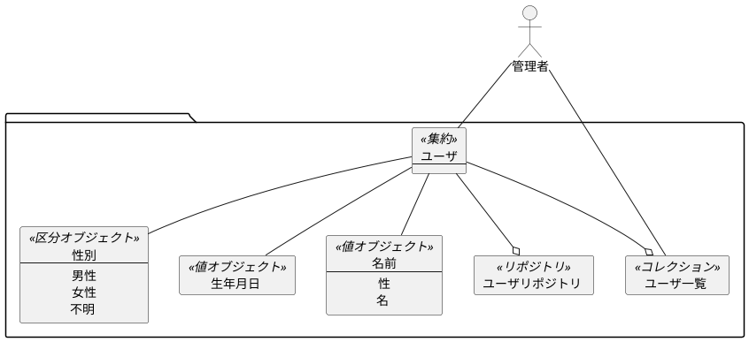

# 01_要求分析
Stakeholdersの要求を分析・定義するプロセス。

## ⅰ. 機能要求定義
システムに対する（抽象度の高い）機能要求を整理して一覧化する。
1. 管理者はユーザの名前、性別、生年月日を登録できなければならない。
2. 管理者は登録されたユーザの一覧を閲覧できなければならない。
3. 管理者はユーザの飲酒・喫煙・結婚可否を確認できなければならない。
4. GUIはHTML/Javascriptで構成され、Web APIを呼び出す。
5. 最大1000ユーザを登録できなければならない。

## ⅱ. ドメインモデリング
機能要求やドメインエキスパートとの会話を元に、
システム化対象領域の言葉（ユビキタス言語）を整理してドメインモデルとして管理する。

### ガイドライン
- 問題領域に着目する。
- ユビキタス言語からアクター、集約、値オブジェクト、区分オブジェクト、リポジトリ、コレクション、ドメインイベント、ドメインサービスを抽出する。
- 必要であれば単語の辞書を作成する。
- この段階で完璧なドメインモデルを作成する必要はなく、後続のプロセスで必要に応じて更新する。



|  ユビキタス言語  |  説明  |
| ---- | ---- |
|  性別  |  男性、女性、不明の3種類とする。  |
|  飲酒可否  |  20才以上で可能となる。  |
|  喫煙可否  |  20才以上で可能となる。  |
|  結婚可否  |  2021年現在、男性は18才以上、女性は16才以上で可能となる。ただし2022年4月から男女ともに18才となる。|

## ⅲ. 振る舞い要求定義
パッケージ図、ユースケース図、ユースケース記述を用いてユースケースを分析する。
最終的にユースケースを機能要求にマッピングする。

### ガイドライン
- パッケージ図
  - ユースケースを目的で分類して組織化する。
  - 大量のユースケースを俯瞰可能にする。
  - アクター・ユースケースの関連（線で結ぶこと）は不要。
- ユースケース図
  - ステレオタイプのうちinvokesとprecedes以外は必要ない。 
- ユースケース記述
  - ユビキタス言語を使用する。
  - GUIプロトタイプや画面モックアップを使用する。
  - バウンダリクラスの名前（画面名）を記述する。
  - アクターとシステムのやり取りのありのままを叙述する。
  - 2段落（10〜12文）に収める。
  - 「名詞-名詞-動詞」の形式で記述する。
  - 基本コースと代替コースを記述する。
### パッケージ図
```puml
:管理者: as a
package 登録 {
  usecase "ユーザを登録する" 
}
package 検索 {
  usecase "ユーザ一覧を表示する" 
}
a -- 登録
a -- 検索
```
### ユースケース図
```puml
package 登録 {
  :管理者: as a
  usecase "ユーザを登録する" as create
  a --> create
}
```
```puml
package 検索 {
  :管理者: as a
  usecase "ユーザ一覧を表示する" as create
  a --> create
}
```
### ユースケース記述
GUIプロトタイプ
```puml
frame ユーザを登録する {
card test [
基本コース: 

代替コース: 
]
}
```

```puml
frame ユーザ一覧を閲覧する {
card test [
基本コース: 

代替コース: 
]
}
```


## ⅳ. 要求レビュー
参加者：Developers、Stakeholders


# 01_要求分析完了時点の成果物
## 機能要求一覧
## ドメインモデル
## ユースケース一覧
### パッケージ図
### ユースケース図
### ユースケース記述
### 機能要求マッピング