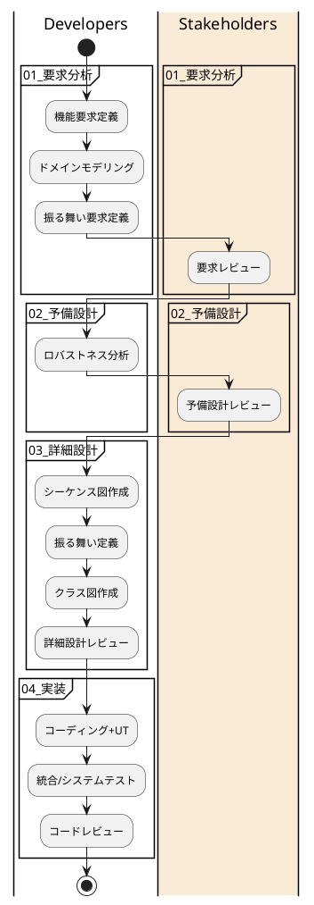

# ICONIX-Samples
ICONIXプロセスの説明と成果物サンプルを提供する。
ドキュメントのMarkdownファイルには [PlantUML](https://github.com/plantuml)
コードを埋め込むため適切な環境で閲覧されたい。表示確認済みの環境は以下の通り。
- [graphviz](https://graphviz.org/) + Chrome ([拡張機能Pegmatite](https://chrome.google.com/webstore/detail/pegmatite/jegkfbnfbfnohncpcfcimepibmhlkldo))
- [graphviz](https://graphviz.org/) + [IntelliJ IDEA 2021.2.3 CE](https://www.jetbrains.com/ja-jp/idea/) (Markdown Extensions(PlantUML))

# ICONIX Process
### Roles
|  Role  |  Description  |
| ------ | ------------- |
|  Developers   |  システム開発チーム  |
|  Stakeholders |  システム化対象領域の各機能（営業、企画、マーケティング等）の担当者やエンドユーザー |
### Process Flow Diagram

### Process List
- [01_要求分析](./01_要求分析)
  1. 機能要求定義
  2. ドメインモデリング
  3. 振る舞い要求定義
  4. 要求レビュー
- [02_予備設計]()
  1. ロバストネス分析
  2. 予備設計レビュー
- [03_詳細設計]()
  1. シーケンス図作成
  2. 振る舞い定義
  3. クラス図作成
  4. 詳細設計レビュー
- [04_実装]()
  1. コーディング+UT
  2. 統合/シナリオテスト
  3. コードレビュー

# 最終的な成果物
TBD